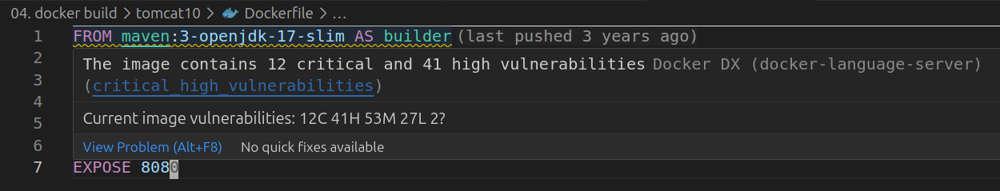

# Docker Plugin

## Шаг 1. Установка

1. Установите VS Code: `sudo snap install code --classic`
2. Запустите VS Code (`code PATH_TO_REPO` в терминале)
3. Установите в VS Code плагин [`Docker DX`](https://marketplace.visualstudio.com/items?itemName=docker.docker): `Ctrl + P` + `ext install docker.docker`

## Шаг 2. Анализ Dockerfile

Откройте один из Dockerfile в редакторе

Убедитесь, что плагин отображает предупреждения, например:

