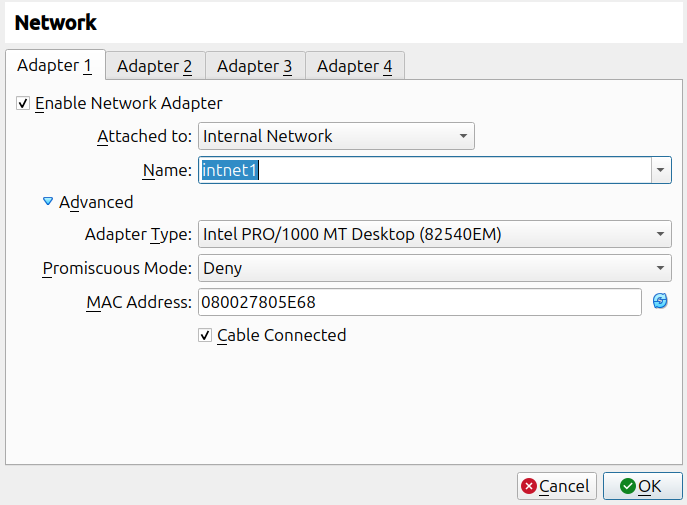
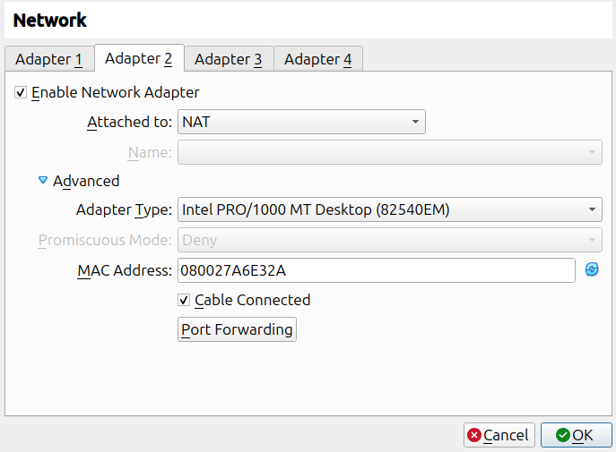
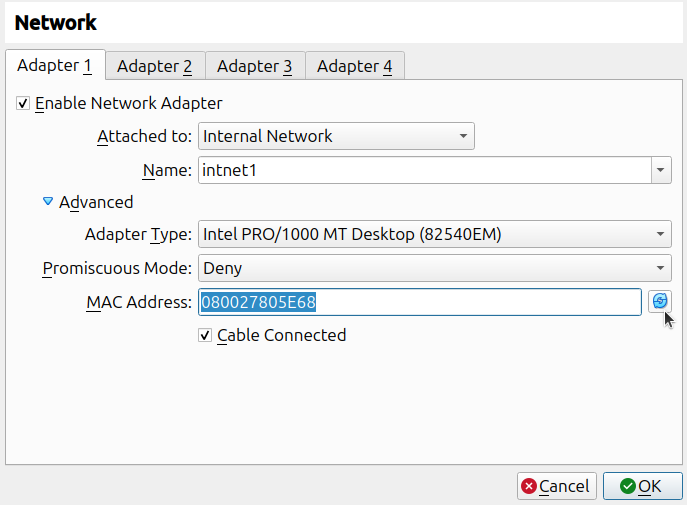

# Kubeadm

**Важно**: в данной лабораторной работе необходимо поднять локальный реестр, либо пользоваться сторонним

Перед началом работы сделайте снапшоты всех виртуальных машин

Для оптимизации работы `dock02` и `dock03` можно отключить там UI:

```sh
sudo systemctl set-default multi-user
sudo reboot
```

## Шаг 0. Удаление microk8s

Удалите на хосте `dock01` microk8s:

```sh
sudo snap remove microk8s --purge
```

Если у вас были алиасы в `.bashrc` на `kubectl`, закомментируйте/удалите их

## Шаг 1. Сеть intnet1/intnet2

В зависимости от вашего пользователя (user1/user2) выберите для первого адаптера всех виртуальных машин сеть `intnet1` (для user1) или `intnet2` (для user2)



На машины dock02 и dock03 добавьте вторым сетевым интерфейсом NAT:



## Шаг 1. Prerequisites

### SSH

Сгенерируйте на `dock01` SSH-ключи:
```sh
ssh-keygen -t ed25519 -f ~/.ssh/id_ed25519
```

Скопируйте на `dock02` и `dock03` публичный ключ:
```sh
ssh-copy-id -i ~/.ssh/id_ed25519.pub 192.168.56.12
ssh-copy-id -i ~/.ssh/id_ed25519.pub 192.168.56.13
```

### Уникальность MAC

Проверьте на всех хостах уникальность MAC и product id (на хосты `dock02` и `dock03` можно заходить по SSH):

```yml
ip addr show
# вывод
2: enp0s3: <BROADCAST,MULTICAST,UP,LOWER_UP> mtu 1500 qdisc fq_codel state UP group default qlen 1000
    link/ether 08:00:27:80:5e:68 brd ff:ff:ff:ff:ff:ff
    inet 192.168.56.11/24 brd 192.168.56.255 scope global noprefixroute enp0s3
       valid_lft forever preferred_lft forever
```

Значение `link/ether 08:00:27:80:5e:68` на всех хостах должно быть разное!

Если оно одинаковое, то перегенерируйте MAC средствами VirtualBox:



### Уникальность product id

В CMD (не PowerShell) Windows выполните:

```sh
"C:\Program Files\Oracle\VirtualBox\VBoxManage.exe" list vms
# вывод:
"dock01" {af1174a4-d6cc-4f53-86e2-7d84730ac0a8}
"dock02" {9a34306e-5c65-44b5-9625-a562772dcd5c}
"dock03" {4202c32a-a928-420b-bc6e-0b09df685f3c}
```

Убедитесь, что у всех машин уникальный UUID (в скобках)

## Шаг 2. /etc/hosts

Поместите в `/etc/hosts` всех машин для удобства следующие записи (`sudoedit /etc/hosts`):

```hosts
192.168.56.11 registry.local
192.168.56.11 db.local
192.168.56.11 dock01
192.168.56.12 dock02
192.168.56.13 dock03
```

Для работы с хостами `dock02` и `dock03` можно использовать SSH (логин &mdash; student, пароль &mdash; pass)

## Шаг 3. Отключение Swap

Проверьте, включен ли swap:
```sh
swapon -show
```

Если включен, отключите swap на всех хостах командами:
```sh
sudo swapoff -a
sudo sed -i '/\tswap\t/s/^/#/' /etc/fstab
```

## Шаг 4. Установка Container Runtime

В качестве Container Runtime мы будем использовать containerd из репозитория Docker

На `dock01` убедитесь, что вы используете containerd v2 (и ставили docker из репозитория Docker, а не Ubuntu):
```sh
containerd --version
```

Если выводится v1.x.x, то переустанавливаете Docker в соответствии с самой первой лабораторной работой ([Установка Docker](../01.%20docker%20installation/01.%20LAB%20(installation).md))

Проделайте следующие шаги на машинах `dock02`, `dock03`:

1. Удаление старых пакетов:

```sh
for pkg in docker.io docker-doc docker-compose docker-compose-v2 podman-docker containerd runc; do sudo apt-get remove $pkg; done
```

2. Добавление репозиториев:

```sh
# Add Docker's official GPG key:
sudo apt-get update
sudo apt-get install ca-certificates curl
sudo install -m 0755 -d /etc/apt/keyrings
sudo curl -fsSL https://download.docker.com/linux/ubuntu/gpg -o /etc/apt/keyrings/docker.asc
sudo chmod a+r /etc/apt/keyrings/docker.asc

# Add the repository to Apt sources:
echo \
  "deb [arch=$(dpkg --print-architecture) signed-by=/etc/apt/keyrings/docker.asc] https://download.docker.com/linux/ubuntu \
  $(. /etc/os-release && echo "${UBUNTU_CODENAME:-$VERSION_CODENAME}") stable" | \
  sudo tee /etc/apt/sources.list.d/docker.list > /dev/null
sudo apt-get update
```

3. Установка пакетов:

```sh
sudo apt-get install -y containerd.io
```

4. Проверка сервиса systemd:

```sh
systemctl status containerd
# ожидаемый вывод
● containerd.service - containerd container runtime
     Loaded: loaded (/usr/lib/systemd/system/containerd.service; enabled; preset: enabled)
     Active: active (running) since ...
```

## Шаг 5. [Конфигурирование containerd](https://kubernetes.io/docs/setup/production-environment/container-runtimes/#containerd-systemd)

**Важно**: этот шаг выполняется на всех трёх нодах (`dock01`, `dock02`, `dock03`)

0. Включите IPv4 packet forwarding:

```sh
# sysctl params required by setup, params persist across reboots
cat <<EOF | sudo tee /etc/sysctl.d/k8s.conf
net.ipv4.ip_forward = 1
EOF

# Apply sysctl params without reboot
sudo sysctl --system
```

1. Формирование дефолтного конфиа containerd:

```sh
containerd config default | sudo tee /etc/containerd/config.toml
```

2. Задействование systemd cgroup driver:

Необходимо отредактировать файл так, чтобы в секции `runc` был выставлен параметр `SystemdCgroup = true` (примерно 109 строка):

```toml
[plugins.'io.containerd.cri.v1.runtime'.containerd.runtimes.runc]
  ...
  [plugins.'io.containerd.cri.v1.runtime'.containerd.runtimes.runc.options]
    SystemdCgroup = true
```

```sh
sudo sed -i 's/SystemdCgroup \= false/SystemdCgroup \= true/' /etc/containerd/config.toml
```

3. Перезапуск containerd:

```sh
sudo systemctl daemon-reload
sudo systemctl restart containerd
```

## Шаг 6. Установка kubeadm

На всех трёх машинах выполните следующие команды:

1. Установка зависимостей:

```sh
sudo apt-get update
# apt-transport-https may be a dummy package; if so, you can skip that package
sudo apt-get install -y apt-transport-https ca-certificates curl gpg
```

2. Установка публичного ключа k8s:

```sh
# If the directory `/etc/apt/keyrings` does not exist, it should be created before the curl command, read the note below.
# sudo mkdir -p -m 755 /etc/apt/keyrings
curl -fsSL https://pkgs.k8s.io/core:/stable:/v1.34/deb/Release.key | sudo gpg --dearmor -o /etc/apt/keyrings/kubernetes-apt-keyring.gpg
```

3. Добавление репозитория:

```sh
# This overwrites any existing configuration in /etc/apt/sources.list.d/kubernetes.list
echo 'deb [signed-by=/etc/apt/keyrings/kubernetes-apt-keyring.gpg] https://pkgs.k8s.io/core:/stable:/v1.34/deb/ /' | sudo tee /etc/apt/sources.list.d/kubernetes.list
```

4. Установка kubelet, kubeadm и kubectl:

Для `dock01`:

```sh
sudo apt-get update
sudo apt-get install -y kubelet kubeadm kubectl
sudo apt-mark hold kubelet kubeadm kubectl
```

Для `dock02`, `dock03` (kubectl не ставится):

```sh
sudo apt-get update
sudo apt-get install -y kubelet kubeadm
sudo apt-mark hold kubelet kubeadm
```


## Шаг 7. Инициализация Control Plane (dock01)

**Важно**: выполняется только на `dock01`!

0. Скачивание необходимых образов:

```sh
sudo kubeadm config images pull
```

Рекомендуется после скачивания образов выключить машину и сделать снапшот

1. Инициализация кластера:

```sh
sudo kubeadm init \
  --pod-network-cidr=10.244.0.0/16 \
  --apiserver-advertise-address=192.168.56.11
```

2. Копирование конфигурации доступа для kubectl:

```sh
mkdir -p $HOME/.kube
sudo cp -i /etc/kubernetes/admin.conf $HOME/.kube/config
sudo chown $(id -u):$(id -g) $HOME/.kube/config
```

3. Настройка [Code Completion для kubectl](https://kubernetes.io/docs/tasks/tools/install-kubectl-linux/#enable-shell-autocompletion):

**Важно**: не забудьте предварительно удалить/закомментировать всё, что было связано с `microk8s kubectl`!

```sh
sudo apt-get update && sudo apt-get install bash-completion
echo 'source <(kubectl completion bash)' >>~/.bashrc
echo 'alias k=kubectl' >>~/.bashrc
echo 'complete -o default -F __start_kubectl k' >>~/.bashrc
source ~/.bashrc
```

5. Установка [Calico CNI - Container Network Interface](https://docs.tigera.io/calico/latest/getting-started/kubernetes/quickstart):

Рекомендуется выключить машину и сделать снапшот перед выполнением этого пункта

```sh
k create -f https://raw.githubusercontent.com/projectcalico/calico/v3.31.1/manifests/tigera-operator.yaml
```

Подождите несколько минут, чтобы манифесты отработали

```sh
curl -O https://raw.githubusercontent.com/projectcalico/calico/v3.31.1/manifests/custom-resources.yaml
```

Отредактируйте первый "блок" следующим образом:

```yaml
apiVersion: operator.tigera.io/v1
kind: Installation
metadata:
  name: default
spec:
  # Configures Calico networking.
  calicoNetwork:
    nodeAddressAutodetectionV4:
      interface: enp0s3
    ipPools:
      - name: default-ipv4-ippool
        blockSize: 26
        cidr: 10.244.0.0/16
        encapsulation: VXLANCrossSubnet
        natOutgoing: Enabled
        nodeSelector: all()
```

Где `enp0s3` - это имя интерфейса для intnet, на котором IP 192.168.56.xx (11, 12, 13)

Примените:
```sh
k apply -f custom-resources.yaml
```

Ожидайте пока в результате следующей команды в колонке `AVAILABLE` у все не станет `True`
```sh
watch kubectl get tigerastatus
# Ождиаемый вывод:
NAME                            AVAILABLE   PROGRESSING   DEGRADED   SINCE
apiserver                       True        False         False      XX
calico                          True        False         False      XX 
goldmane                        True        False         False      XX
ippools                         True        False         False      XX
whisker                         True        False         False      XX
```

6. Проверка статуса ноды:

```sh
k get nodes
# ожидаемый вывод
NAME     STATUS     ROLES           AGE   VERSION
dock01   Ready   control-plane   XXm   v1.34.2
```

## Шаг 8. Добавление других узлов

1. На `dock01` выведите команду подключения:

```sh
kubeadm token create --print-join-command
```

2. На `dock02` и `dock03` выполните (обратите внимание на `sudo`):

```sh
sudo kubeadm join 192.168.56.11:6443 \
  --token ... \
  --discovery-token-ca-cert-hash sha256:...
```

3. Дождитесь подключения нод в кластер:

```sh
watch kubectl get nodes
```

4. Самостоятельно создайте namespace appns и настройте для kubectl текущий namespace:

```sh
k config set contexts.kubernetes-admin@kubernetes.namespace appns
```

5. Попробуйте самостоятельно развернуть простой Deployment из двух реплик + Service, состоящий из:
- основного контейнера с Nginx
- init-контейнера, который в каталог со статикой Nginx кладёт HTML со сгенерированным UUID

Удостоверьтесь, что всё работает через `curl`

Посмотрите, как Pod'ы распределились по нодам:

```sh
k get pods -o wide 
```

## Шаг 9. Работа с Registry

Для работы с registry необходимо `/usr/local/share/ca-certificates/ca.crt` скопировать на узлы `dock02` и `dock03` и выполнить там `sudo update-ca-certificates`

Выполните этот шаг самостоятельно

